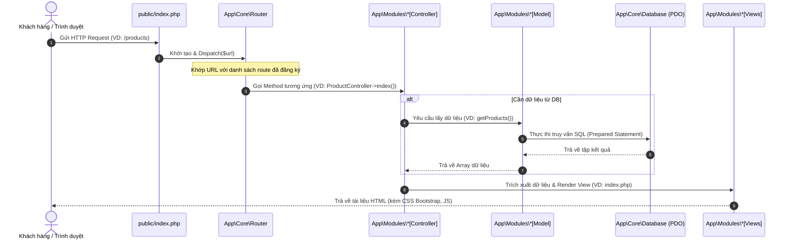

# 📋 PHẦN 2: KIẾN TRÚC HỆ THỐNG VÀ VÒNG ĐỜI REQUEST
## DỰ ÁN: WEBSITE THƯƠNG MẠI ĐIỆN TỬ VĂN PHÒNG PHẨM (OFFICE SUPPLIES)

---

## 1. Kiến trúc Hệ thống Custom MVC

Hệ thống được thiết kế theo mô hình **Model-View-Controller (MVC)** tự xây dựng. Ưu điểm của mô hình này là tách biệt rõ ràng 3 lớp xử lý chính:

*   **Model (Lớp Dữ liệu):** Chịu trách nhiệm tương tác với cơ sở dữ liệu MySQL, thực thi các câu lệnh truy vấn và xử lý các quy tắc nghiệp vụ dữ liệu.
*   **View (Lớp Hiển thị):** Chứa giao diện người dùng hiển thị dữ liệu (HTML5, Bootstrap 5, Font Awesome). Lớp này không trực tiếp truy cập cơ sở dữ liệu mà chỉ nhận dữ liệu từ Controller.
*   **Controller (Lớp Điều khiển):** Đóng vai trò cầu nối, tiếp nhận yêu cầu từ Router, gọi Model xử lý dữ liệu và truyền kết quả cho View để trả về trình duyệt client.

Hệ thống bổ sung thêm lớp **Router (Định tuyến)** để quản lý tất cả các liên kết URL thân thiện (SEO URLs).

---

## 2. Vòng đời Request (Request Lifecycle)

Mọi request từ phía người dùng (Client/Browser) đều bắt đầu tại một điểm truy cập duy nhất (Single Entry Point) là tệp `public/index.php`. 

### Quy trình tuần tự xử lý một Request:
1.  **Client** gửi một HTTP Request đến máy chủ (Ví dụ: `http://localhost/vhoang_repo/products`).
2.  Tệp cấu hình máy chủ `.htaccess` viết lại URL và điều hướng yêu cầu về `public/index.php`.
3.  `public/index.php` nạp trình tự động tải lớp (Autoloader), nạp tệp cấu hình môi trường `.env` và tệp cấu hình chung `config/config.php`.
4.  Đối tượng `App\Core\Router` được khởi tạo và phân tích URL để tìm Controller và Action khớp với Route đã đăng ký.
5.  **Router** khởi tạo Controller tương ứng và gọi Method/Action được yêu cầu.
6.  **Controller** giao tiếp với **Model** tương ứng để lấy dữ liệu (Ví dụ: Danh sách sản phẩm, chi tiết sản phẩm).
7.  **Model** kết nối với Cơ sở dữ liệu thông qua đối tượng PDO duy nhất (`App\Core\Database`) để thực thi truy vấn an toàn và trả kết quả về Controller.
8.  **Controller** nhận dữ liệu, trích xuất biến và gọi phương thức `$this->view()` để nạp tệp giao diện (View).
9.  **View** render mã nguồn HTML đã chứa dữ liệu động và gửi về cho trình duyệt của **Client** hiển thị.

---

## 3. Sơ đồ tuần tự xử lý Request (Sequence Diagram)

Mã nguồn sơ đồ tuần tự biểu diễn bằng Mermaid dưới đây mô tả trực quan dòng chạy của một request trong hệ thống:

