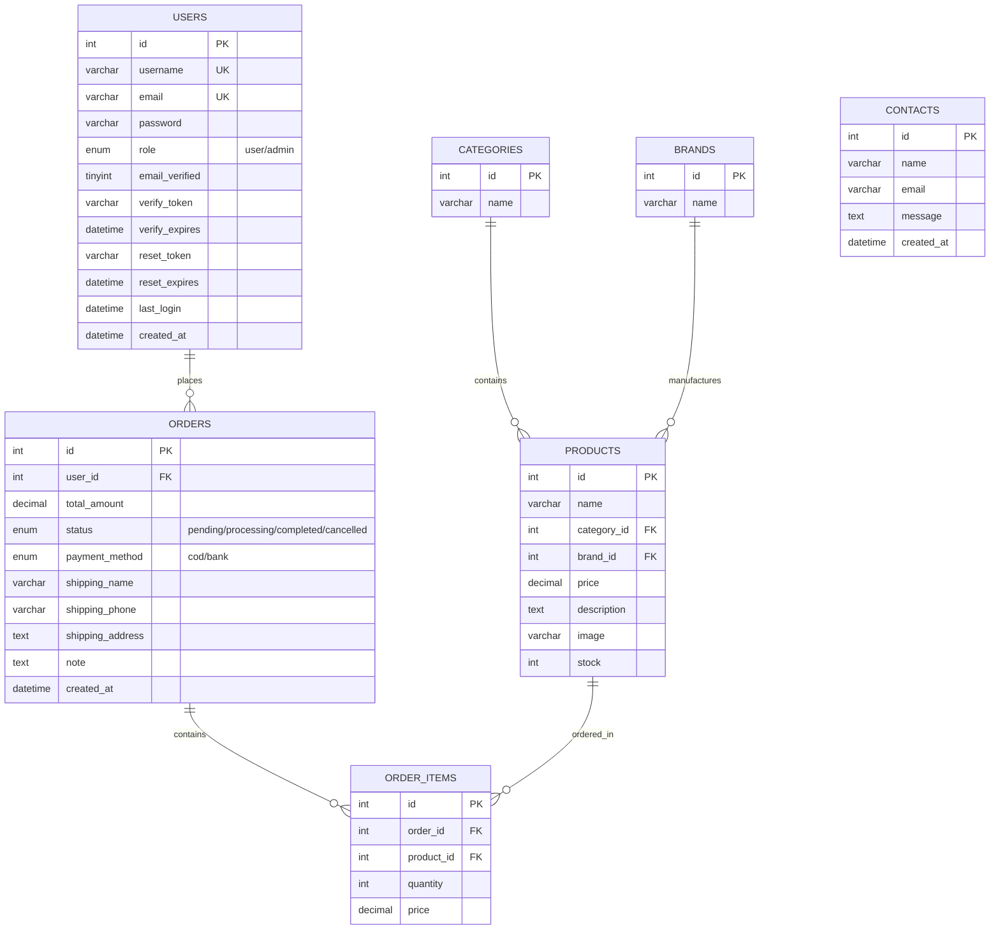

# 📋 PHẦN 3: THIẾT KẾ CƠ SỞ DỮ LIỆU VÀ SƠ ĐỒ ERD
## DỰ ÁN: WEBSITE THƯƠNG MẠI ĐIỆN TỬ VĂN PHÒNG PHẨM (OFFICE SUPPLIES)

---

## 1. Thiết kế Cơ sở Dữ liệu (Database Design)

Cơ sở dữ liệu của dự án có tên là `office_supplies`, được xây dựng trên hệ quản trị cơ sở dữ liệu **MySQL/MariaDB** và được thiết kế chuẩn hóa đến dạng chuẩn 3 (3NF) để đảm bảo toàn vẹn dữ liệu và tránh dư thừa dữ liệu. 

Hệ thống bao gồm **7 bảng chính**:

### 1.1. Bảng `brands` (Thương hiệu)
*   Lưu trữ thông tin các thương hiệu sản phẩm văn phòng phẩm.
*   **Các cột:**
    *   `id` (INT, PK, Auto Increment): Mã định danh thương hiệu.
    *   `name` (VARCHAR(100)): Tên thương hiệu.

### 1.2. Bảng `categories` (Danh mục)
*   Lưu trữ phân loại của sản phẩm (VD: Đồ học tập, Bàn ghế...).
*   **Các cột:**
    *   `id` (INT, PK, Auto Increment): Mã định danh danh mục.
    *   `name` (VARCHAR(100)): Tên danh mục sản phẩm.

### 1.3. Bảng `users` (Người dùng)
*   Lưu trữ thông tin tài khoản người dùng, bao gồm cả Khách hàng và Quản trị viên.
*   **Các cột:**
    *   `id` (INT, PK, Auto Increment): Mã định danh người dùng.
    *   `username` (VARCHAR(50), UNIQUE): Tên đăng nhập.
    *   `email` (VARCHAR(100), UNIQUE): Địa chỉ email.
    *   `password` (VARCHAR(255)): Mật khẩu đã được mã hóa (bằng hàm `password_hash`).
    *   `role` (ENUM('user', 'admin')): Quyền hạn của tài khoản.
    *   `email_verified` (TINYINT(1)): Trạng thái xác thực email (0: Chưa xác thực, 1: Đã xác thực).
    *   `verify_token` (VARCHAR(64)): Mã token xác thực email gửi qua hòm thư.
    *   `verify_expires` (DATETIME): Thời hạn token xác thực email.
    *   `reset_token` (VARCHAR(64)): Mã token phục hồi mật khẩu.
    *   `reset_expires` (DATETIME): Thời hạn token reset mật khẩu.
    *   `last_login` (DATETIME): Thời gian đăng nhập gần nhất.
    *   `created_at` (DATETIME): Ngày tạo tài khoản.

### 1.4. Bảng `products` (Sản phẩm)
*   Lưu trữ thông tin chi tiết về các sản phẩm văn phòng phẩm.
*   **Các cột:**
    *   `id` (INT, PK, Auto Increment): Mã định danh sản phẩm.
    *   `name` (VARCHAR(200)): Tên sản phẩm.
    *   `category_id` (INT, FK): Liên kết tới bảng `categories`.
    *   `brand_id` (INT, FK): Liên kết tới bảng `brands`.
    *   `price` (DECIMAL(10,2)): Đơn giá sản phẩm.
    *   `description` (TEXT): Mô tả sản phẩm.
    *   `image` (VARCHAR(255)): Đường dẫn tệp hình ảnh sản phẩm.
    *   `stock` (INT): Số lượng hàng còn lại trong kho.

### 1.5. Bảng `orders` (Đơn hàng)
*   Lưu trữ thông tin tổng quát về các đơn đặt hàng từ khách hàng.
*   **Các cột:**
    *   `id` (INT, PK, Auto Increment): Mã định danh đơn hàng.
    *   `user_id` (INT, FK): Liên kết tới người mua trong bảng `users`.
    *   `total_amount` (DECIMAL(12,2)): Tổng số tiền của đơn hàng.
    *   `status` (ENUM('pending', 'processing', 'completed', 'cancelled')): Trạng thái đơn hàng.
    *   `payment_method` (ENUM('cod', 'bank')): Phương thức thanh toán.
    *   `shipping_name` (VARCHAR(100)): Họ tên người nhận hàng.
    *   `shipping_phone` (VARCHAR(20)): Số điện thoại người nhận.
    *   `shipping_address` (TEXT): Địa chỉ giao nhận hàng.
    *   `note` (TEXT): Ghi chú đặt hàng của khách hàng.
    *   `created_at` (DATETIME): Thời gian đặt hàng.

### 1.6. Bảng `order_items` (Chi tiết Đơn hàng)
*   Lưu trữ thông tin chi tiết các mặt hàng có trong một đơn hàng.
*   **Các cột:**
    *   `id` (INT, PK, Auto Increment): Mã định danh chi tiết.
    *   `order_id` (INT, FK): Liên kết tới bảng `orders` (ON DELETE CASCADE).
    *   `product_id` (INT, FK): Liên kết tới bảng `products`.
    *   `quantity` (INT): Số lượng đặt mua của sản phẩm đó.
    *   `price` (DECIMAL(10,2)): Giá bán của sản phẩm tại thời điểm mua.

### 1.7. Bảng `contacts` (Liên hệ)
*   Lưu trữ thông điệp, ý kiến đóng góp từ khách hàng gửi qua trang liên hệ.
*   **Các cột:**
    *   `id` (INT, PK, Auto Increment): Mã định danh liên hệ.
    *   `name` (VARCHAR(150)): Họ tên người gửi.
    *   `email` (VARCHAR(150)): Địa chỉ email người gửi.
    *   `message` (TEXT): Nội dung góp ý/liên hệ.
    *   `created_at` (DATETIME): Thời gian gửi liên hệ.

---

## 2. Sơ đồ Thực thể Quan hệ (ERD)

Sơ đồ ERD dưới đây mô tả mối quan hệ giữa các bảng trong cơ sở dữ liệu:

