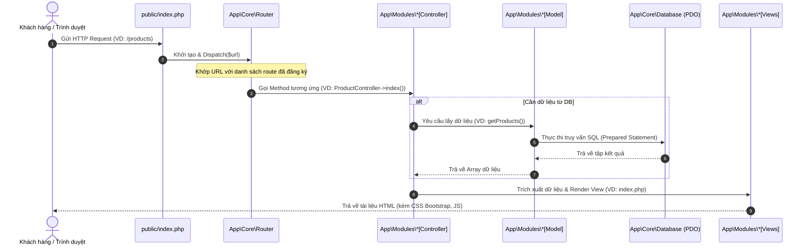
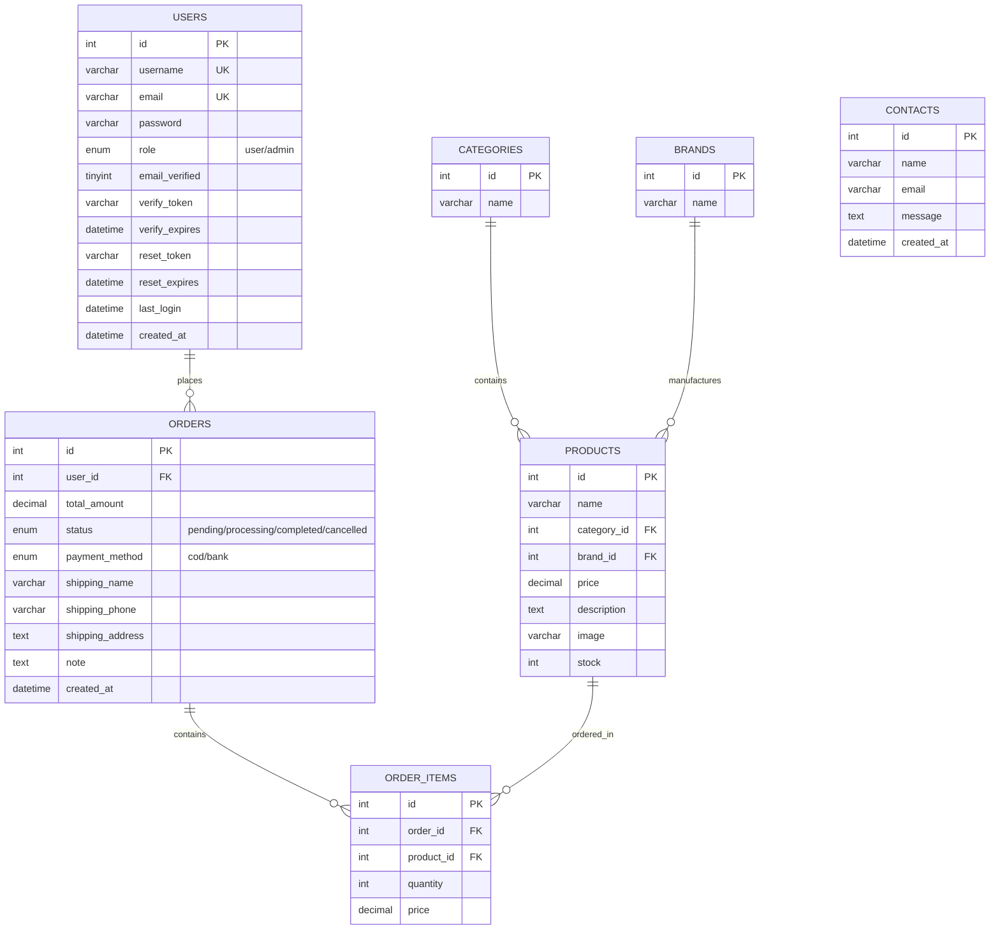

# BÁO CÁO ĐÁNH GIÁ HỆ THỐNG & TÀI LIỆU BÀI TẬP LỚN
## DỰ ÁN: WEBSITE THƯƠNG MẠI ĐIỆN TỬ VĂN PHÒNG PHẨM (OFFICE SUPPLIES)

---

## 1. Đánh giá Tổng quan về Hệ thống
Hệ thống hiện tại là một website Thương mại Điện tử bán văn phòng phẩm cơ bản, được xây dựng trên nền tảng **PHP thuần** và đang được cấu trúc hóa theo kiến trúc **MVC tự dựng (Custom MVC Framework)**. 

### Đánh giá mức độ hoàn thiện để triển khai Production sơ khai (MVP):
> [!NOTE]
> **Kết luận:** Hệ thống **ĐÃ ĐỦ ĐIỀU KIỆN** để triển khai ở mức độ **Production sơ khai (Minimum Viable Product - MVP)** cho các mục tiêu thử nghiệm, vận hành quy mô nhỏ hoặc làm **Bài tập lớn / Đồ án môn học xuất sắc**.

#### Các điểm mạnh đã hoàn thành (Sẵn sàng cho Production sơ khai):
1. **Kiến trúc MVC chuẩn hóa:** Phân tách rõ ràng giữa `Core` (Router, Controller, Model, Database) và các `Modules` nghiệp vụ. Điều này giúp hệ thống dễ dàng bảo trì và mở rộng.
2. **Tính năng cốt lõi hoàn chỉnh:**
   - **Phía Khách hàng:** Xem sản phẩm, tìm kiếm, lọc theo thương hiệu/danh mục, giỏ hàng, thanh toán COD (nhận hàng thanh toán), quản lý lịch sử đơn hàng, gửi biểu mẫu liên hệ.
   - **Phía Admin:** Dashboard thống kê sơ bộ, quản lý CRUD (Thêm, Sửa, Xóa) Sản phẩm, Danh mục, Thương hiệu, quản lý Đơn hàng (cập nhật trạng thái) và Người dùng.
3. **Cơ chế bảo mật nâng cao (Đã được nâng cấp cực tốt ở bản v1.1):**
   - **CSRF Protection:** Chống giả mạo yêu cầu từ trang khác trên tất cả các form POST.
   - **Rate Limiting:** Chống brute-force login (giới hạn 5 lần đăng nhập sai/5 phút cho mỗi IP).
   - **Xác thực Email & Quên mật khẩu:** Gửi mail với token bảo mật (hạn dùng 24h cho xác thực và 1h cho reset mật khẩu).
   - **Bảo mật Session:** Thiết lập `httponly` và `samesite=Lax` để chặn đánh cắp cookie session qua XSS.
   - **SQL Injection Prevention:** Sử dụng PDO với prepared statements (trong `App\Core\Database.php`) loại bỏ hoàn toàn nguy cơ tấn công SQL Injection.
   - **Environment Variable (`.env`):** Đã tách biệt cấu hình nhạy cảm (Database, SMTP Mail) ra khỏi mã nguồn để tăng tính an toàn khi deploy lên Git/Production.

---

## 2. Kiến trúc Hệ thống & Vòng đời Request (Request Lifecycle)

Hệ thống sử dụng cơ chế **Single Entry Point** thông qua tệp `public/index.php`. Mọi request từ client sẽ được định tuyến thông qua lớp `App\Core\Router`.



---

## 3. Sơ đồ Thực thể Quan hệ (ERD - Database Schema)

Cơ sở dữ liệu gồm **7 bảng** chính, được thiết kế chuẩn hóa để tránh trùng lặp dữ liệu:



---

## 4. Đặc tả Yêu cầu & Sơ đồ Usecase (Usecase Diagrams)

### 4.1. Danh sách Usecase theo Tác nhân (Actor)

#### Tác nhân: Khách vãng lai (Guest / Anonymous User)
- **UC01:** Đăng ký tài khoản mới (Yêu cầu xác thực Email qua Token).
- **UC02:** Đăng nhập hệ thống (Bảo vệ bằng Rate Limiting 5 lần/5 phút).
- **UC03:** Quên mật khẩu & Đặt lại mật khẩu (Gửi email chứa Token đặt lại).
- **UC04:** Duyệt và Tìm kiếm sản phẩm (Lọc theo danh mục, lọc theo thương hiệu).
- **UC05:** Xem chi tiết sản phẩm.
- **UC06:** Quản lý giỏ hàng tạm thời (Thêm sản phẩm, sửa số lượng, xóa khỏi giỏ).
- **UC07:** Gửi liên hệ/góp ý.

#### Tác nhân: Khách hàng (Registered Customer)
*Kế thừa toàn bộ quyền của Khách vãng lai và bổ sung thêm:*
- **UC08:** Đặt hàng & Thanh toán (Phương thức nhận hàng thanh toán COD).
- **UC09:** Xem lịch sử mua hàng và theo dõi trạng thái đơn hàng.
- **UC10:** Đăng xuất khỏi hệ thống.

#### Tác nhân: Quản trị viên (Admin)
- **UC11:** Đăng nhập trang quản trị.
- **UC12:** Xem dashboard thống kê (Doanh thu sơ bộ, số lượng đơn hàng, sản phẩm).
- **UC13:** Quản lý Sản phẩm (Thêm, sửa, xóa, tải lên hình ảnh sản phẩm).
- **UC14:** Quản lý Danh mục (CRUD).
- **UC15:** Quản lý Thương hiệu (CRUD).
- **UC16:** Quản lý và xử lý Đơn hàng (Cập nhật trạng thái đơn hàng: Chờ duyệt -> Đang xử lý -> Hoàn thành / Hủy).
- **UC17:** Quản lý tài khoản Người dùng (Xem danh sách, phân quyền).

### 4.2. Sơ đồ Usecase Tổng quát (Mermaid)

```mermaid
graph TD
    %% Định nghĩa các Actor
    Guest[Khách vãng lai]
    Customer[Khách hàng đã đăng ký]
    Admin[Quản trị viên]

    %% Kế thừa tác nhân
    Customer -->|Kế thừa| Guest

    %% Usecase Khách vãng lai
    subgraph Frontend - Khách hàng
        UC01(UC01: Đăng ký tài khoản)
        UC02(UC02: Đăng nhập)
        UC03(UC03: Quên/Đặt lại mật khẩu)
        UC04(UC04: Tìm kiếm/Lọc sản phẩm)
        UC05(UC05: Xem chi tiết sản phẩm)
        UC06(UC06: Quản lý giỏ hàng)
        UC07(UC07: Gửi liên hệ)
        UC08(UC08: Đặt hàng & Checkout COD)
        UC09(UC09: Xem lịch sử đơn hàng)
    end

    %% Usecase Admin
    subgraph Backend - Quản trị (Admin Panel)
        UC11(UC11: Đăng nhập Admin)
        UC12(UC12: Xem Dashboard Thống kê)
        UC13(UC13: Quản lý Sản phẩm CRUD)
        UC14(UC14: Quản lý Danh mục CRUD)
        UC15(UC15: Quản lý Thương hiệu CRUD)
        UC16(UC16: Quản lý & Cập nhật Đơn hàng)
        UC17(UC17: Quản lý Người dùng)
    end

    %% Liên kết Actor và Usecase
    Guest --> UC01
    Guest --> UC02
    Guest --> UC03
    Guest --> UC04
    Guest --> UC05
    Guest --> UC06
    Guest --> UC07

    Customer --> UC08
    Customer --> UC09

    Admin --> UC11
    Admin --> UC12
    Admin --> UC13
    Admin --> UC14
    Admin --> UC15
    Admin --> UC16
    Admin --> UC17
```

---

## 5. Checklist và Lộ trình đưa lên Production thực tế

Dù hệ thống đã đủ tốt cho giai đoạn sơ khai/báo cáo học tập, nhưng để đưa lên **môi trường Production thực tế** chịu tải thực và đảm bảo an toàn tuyệt đối cho người dùng cuối, bạn cần hoàn thành các bước chuẩn bị sau:

### 🛠️ Lộ trình triển khai môi trường (Deployment Checklist)

| STT | Hạng mục | Chi tiết triển khai | Trạng thái |
| :--- | :--- | :--- | :---: |
| **1** | **SSL/HTTPS** | Bắt buộc cấu hình SSL (Let's Encrypt - miễn phí) trên Web Server (Apache/Nginx) để mã hóa toàn bộ lưu lượng dữ liệu tránh bị nghe lén (Sniffing) mật khẩu và thông tin đặt hàng. | 🔲 Cần làm |
| **2** | **Tắt chế độ Debug/Hiển thị lỗi** | Trong file `.env` hoặc `config/config.php`, thiết lập `ini_set('display_errors', 0)` và `ini_set('log_errors', 1)` để ghi lỗi vào file log hệ thống thay vì hiển thị trực tiếp lên màn hình của khách hàng (gây lộ cấu trúc thư mục và thông tin nhạy cảm). | 🔲 Cần làm |
| **3** | **Cấu hình Mailer Thực tế** | Thay đổi từ SMTP Gmail cá nhân (dễ bị khóa hoặc chặn IP nếu gửi số lượng lớn) sang dịch vụ gửi Email chuyên nghiệp: **SendGrid**, **Mailgun**, hoặc **Amazon SES**. Cập nhật thông số này vào tệp `.env`. | 🔲 Cần làm |
| **4** | **Database Indexing** | Thêm chỉ mục (Index) trên các cột thường xuyên tìm kiếm và lọc: `products.name`, `products.price`, `orders.status`, `users.email`. Điều này giúp hệ thống phản hồi cực nhanh khi số lượng sản phẩm lên hàng ngàn. | 🔲 Cần làm |
| **5** | **Sao lưu (Backup) tự động** | Cấu hình cron job sao lưu cơ sở dữ liệu `office_supplies` hàng ngày và lưu trữ tại một server backup riêng để đề phòng sự cố phần cứng. | 🔲 Cần làm |
| **6** | **Tối ưu hóa tài nguyên tĩnh (Assets)** | Nén (Minify) các file CSS, JS và tối ưu hóa hình ảnh sản phẩm (định dạng WebP/JPEG nén) để trang web tải cực nhanh trên thiết bị di động. | 🔲 Cần làm |
