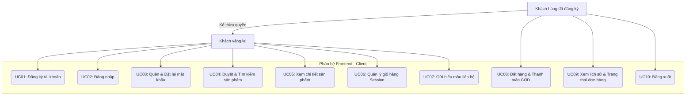
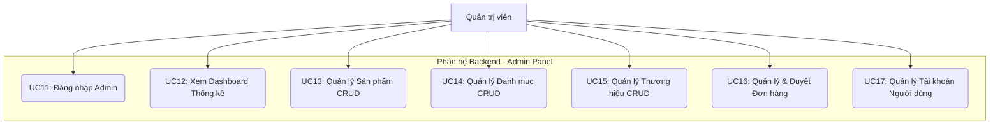
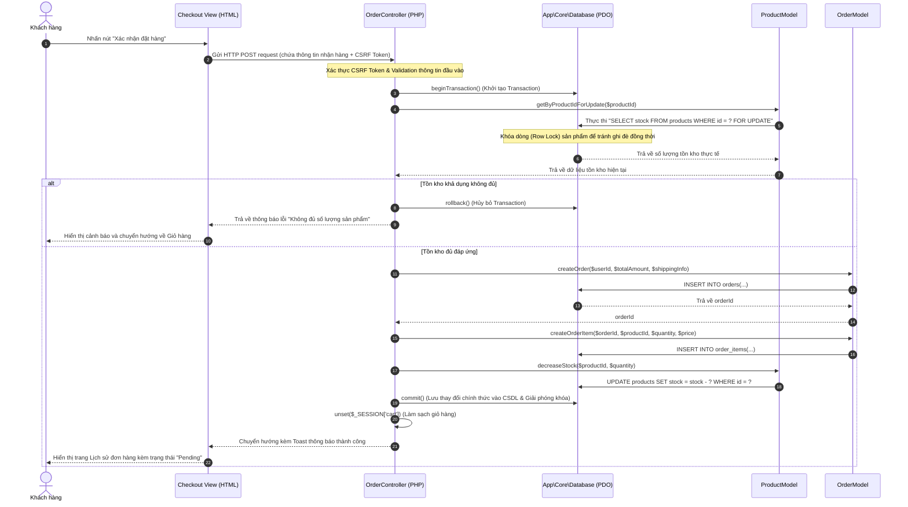
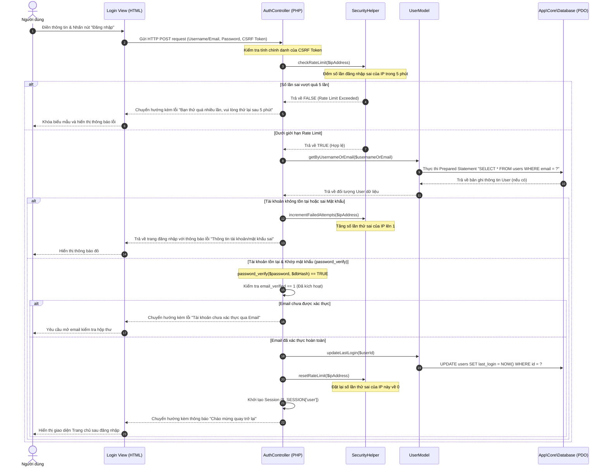

# 📋 TỔNG HỢP TOÀN BỘ USECASE CỦA HỆ THỐNG (OFFICE SUPPLIES)

Tài liệu này tổng hợp toàn bộ các Usecase (Trường hợp sử dụng) của hệ thống website Thương mại điện tử Văn phòng phẩm (Office Supplies). Bạn có thể sao chép trực tiếp nội dung này để đưa vào báo cáo Word hoặc sử dụng mã Mermaid đi kèm để sinh sơ đồ Usecase tự động.

---

## 1. 👥 CÁC TÁC NHÂN (ACTORS) TRONG HỆ THỐNG

Hệ thống phân định rõ ràng 3 tác nhân chính tương tác trực tiếp với ứng dụng:
1.  **Khách vãng lai (Guest):** Người dùng chưa đăng nhập hoặc chưa đăng ký tài khoản. Chỉ có quyền xem thông tin cơ bản.
2.  **Khách hàng (Customer):** Người dùng đã đăng ký và đăng nhập thành công. Kế thừa toàn bộ quyền của Khách vãng lai và có thêm các tính năng mua sắm, đặt hàng.
3.  **Quản trị viên (Admin):** Người dùng có quyền quản trị tối cao (`role = 'admin'`), quản lý nội dung sản phẩm, đơn hàng, khách hàng và hệ thống.

---

## 2. 📊 MÃ NGUỒN MERMAID ĐỂ SINH CÁC SƠ ĐỒ (USECASE DIAGRAMS)

### 2.1. 🌐 HÌNH 3.1: BIỂU ĐỒ USE CASE TỔNG QUÁT HỆ THỐNG (Toàn bộ 17 Use Cases & 3 Actors)
Biểu đồ này biểu diễn cái nhìn toàn cảnh về hệ thống, bao gồm cả 3 tác nhân (`Guest`, `Customer`, `Admin`) và ranh giới phân tách rõ ràng giữa 2 phân hệ Frontend (Client) và Backend (Admin Panel).

*Copy đoạn mã này dán vào **[Mermaid Live Editor](https://mermaid.live)** hoặc import vào **Draw.io** để xuất ảnh:*

```mermaid
graph TD
    %% Định nghĩa các Actor
    Guest[Khách vãng lai]
    Customer[Khách hàng đã đăng ký]
    Admin[Quản trị viên]

    %% Quan hệ thừa kế của Actor
    Customer -->|Kế thừa quyền| Guest

    %% Phân hệ Client (Khách hàng)
    subgraph Phân hệ Frontend - Client
        UC01(UC01: Đăng ký tài khoản)
        UC02(UC02: Đăng nhập)
        UC03(UC03: Quên & Đặt lại mật khẩu)
        UC04(UC04: Duyệt & Tìm kiếm sản phẩm)
        UC05(UC05: Xem chi tiết sản phẩm)
        UC06(UC06: Quản lý giỏ hàng Session)
        UC07(UC07: Gửi biểu mẫu liên hệ)
        UC08(UC08: Đặt hàng & Thanh toán COD)
        UC09(UC09: Xem lịch sử & Trạng thái đơn hàng)
        UC10(UC10: Đăng xuất)
    end

    %% Phân hệ Admin (Quản trị viên)
    subgraph Phân hệ Backend - Admin Panel
        UC11(UC11: Đăng nhập Admin)
        UC12(UC12: Xem Dashboard Thống kê)
        UC13(UC13: Quản lý Sản phẩm CRUD)
        UC14(UC14: Quản lý Danh mục CRUD)
        UC15(UC15: Quản lý Thương hiệu CRUD)
        UC16(UC16: Quản lý & Duyệt Đơn hàng)
        UC17(UC17: Quản lý Tài khoản Người dùng)
    end

    %% Mối quan hệ giữa Actor và Usecase
    Guest --> UC01
    Guest --> UC02
    Guest --> UC03
    Guest --> UC04
    Guest --> UC05
    Guest --> UC06
    Guest --> UC07

    Customer --> UC08
    Customer --> UC09
    Customer --> UC10

    Admin --> UC11
    Admin --> UC12
    Admin --> UC13
    Admin --> UC14
    Admin --> UC15
    Admin --> UC16
    Admin --> UC17
```

---

### 2.2. 🛍️ HÌNH 3.2: BIỂU ĐỒ USE CASE PHÂN HỆ KHÁCH HÀNG (Mua hàng & Tài khoản)
Biểu đồ này chỉ tập trung vào các tính năng thuộc phân hệ **Frontend** dành cho **Khách hàng** và **Khách vãng lai**, loại bỏ hoàn toàn các phần quản lý của Admin để sơ đồ được chi tiết và trực quan hơn đối với chương viết về Khách hàng.

---

### 2.3. ⚙️ HÌNH 3.3: BIỂU ĐỒ USE CASE PHÂN HỆ ADMIN PANEL (Tùy chọn bổ sung cho Báo cáo)
Biểu đồ này tập trung riêng cho phân hệ **Quản trị Backend**, chỉ bao gồm tác nhân `Admin` và các chức năng CRUD, thống kê, kiểm soát đơn hàng. Rất hữu ích nếu báo cáo của bạn có mục riêng về sơ đồ chức năng của Admin.

---

---

## 3. 📝 DANH SÁCH CHI TIẾT CÁC USECASE THEO TÁC NHÂN

### 3.1. Phân hệ Khách hàng & Khách vãng lai (Client-side)

| Mã UC | Tên Usecase | Tác nhân | Mô tả tóm tắt nghiệp vụ |
| :--- | :--- | :--- | :--- |
| **UC01** | Đăng ký tài khoản | Khách vãng lai | Đăng ký tài khoản bằng Username, Email, Mật khẩu. Hệ thống tự động gửi Email chứa token xác thực (hiệu lực 24h). |
| **UC02** | Đăng nhập hệ thống | Khách vãng lai | Đăng nhập bằng tài khoản/email. Áp dụng Rate Limiting chặn IP nếu đăng nhập sai quá 5 lần trong 5 phút. |
| **UC03** | Quên & Đặt lại mật khẩu | Khách vãng lai | Nhập email nhận link chứa token phục hồi mật khẩu gửi qua email (hiệu lực trong 1 giờ). |
| **UC04** | Duyệt & Tìm kiếm sản phẩm | Khách vãng lai | Xem danh sách sản phẩm, lọc theo danh mục hoặc theo thương hiệu sản xuất, tìm kiếm sản phẩm theo tên. |
| **UC05** | Xem chi tiết sản phẩm | Khách vãng lai | Xem chi tiết giá, mô tả, ảnh đại diện và số lượng còn lại trong kho của sản phẩm. |
| **UC06** | Quản lý giỏ hàng Session | Khách vãng lai | Thêm sản phẩm vào giỏ, cập nhật số lượng hoặc xóa sản phẩm khỏi giỏ hàng. Dữ liệu được lưu trữ an toàn trong PHP Session. |
| **UC07** | Gửi biểu mẫu liên hệ | Khách vãng lai | Nhập thông tin liên hệ và lời nhắn góp ý gửi tới ban quản trị hệ thống. |
| **UC08** | Đặt hàng & Thanh toán | Khách hàng | Điền thông tin giao nhận, xác nhận thanh toán COD. Hệ thống dùng Database Transaction và khoá tồn kho để trừ stock. |
| **UC09** | Xem lịch sử đơn hàng | Khách hàng | Xem danh sách đơn hàng đã mua và theo dõi trạng thái đơn hàng (Chờ duyệt, Đang giao, Đã hoàn thành, Đã hủy). |
| **UC10** | Đăng xuất | Khách hàng | Giải phóng dữ liệu phiên làm việc (Session) và chuyển hướng về trang chủ. |

### 3.2. Phân hệ Quản trị (Admin-side)

| Mã UC | Tên Usecase | Tác nhân | Mô tả tóm tắt nghiệp vụ |
| :--- | :--- | :--- | :--- |
| **UC11** | Đăng nhập trang quản trị | Quản trị viên | Đăng nhập vào bảng điều khiển backend của hệ thống bằng tài khoản admin. |
| **UC12** | Xem Dashboard Thống kê | Quản trị viên | Xem biểu đồ và các số liệu tổng hợp doanh thu đơn completed, số lượng đơn hàng, sản phẩm, và khách hàng. |
| **UC13** | Quản lý Sản phẩm | Quản trị viên | Xem danh sách, Thêm mới sản phẩm (kèm upload ảnh lên server), Chỉnh sửa thông tin, và Xóa sản phẩm. |
| **UC14** | Quản lý Danh mục | Quản trị viên | CRUD (Thêm, sửa, xóa) các phân loại sản phẩm (Đồ học tập, Bút viết, Sổ tay...). |
| **UC15** | Quản lý Thương hiệu | Quản trị viên | CRUD (Thêm, sửa, xóa) các nhãn hiệu văn phòng phẩm (Thiên Long, Deli, Hồng Hà...). |
| **UC16** | Quản lý & Duyệt Đơn hàng | Quản trị viên | Xem chi tiết đơn hàng khách đặt, cập nhật trạng thái duyệt đơn hàng (Pending -> Processing -> Completed / Cancelled). |
| **UC17** | Quản lý Tài khoản | Quản trị viên | Theo dõi toàn bộ danh sách tài khoản người dùng, xem thời gian đăng nhập cuối cùng (`last_login`) và phân quyền. |

---

## 4. 📖 ĐẶC TẢ CHI TIẾT CÁC USECASE TRỌNG YẾU (USECASE SPECIFICATIONS)

Dưới đây là đặc tả chi tiết dòng sự kiện của 3 Usecase cốt lõi, thường bắt buộc phải viết chi tiết trong báo cáo:

### 4.1. Đặc tả UC08: Đặt hàng & Thanh toán COD (Thao tác cốt lõi của Khách hàng)

*   **Tên Usecase:** UC08: Đặt hàng & Thanh toán (COD)
*   **Tác nhân chính:** Khách hàng (Customer)
*   **Mục tiêu:** Tạo đơn đặt hàng mới thành công từ giỏ hàng hiện tại của khách hàng.
*   **Điều kiện tiên quyết:** Khách hàng đã đăng nhập thành công và giỏ hàng session có ít nhất một sản phẩm hợp lệ.
*   **Dòng sự kiện chính (Basic Flow):**
    1.  Khách hàng nhấn nút "Thanh toán" tại trang giỏ hàng.
    2.  Hệ thống chuyển hướng tới trang checkout, hiển thị danh sách sản phẩm cần thanh toán và form nhập thông tin giao nhận.
    3.  Khách hàng điền họ tên, số điện thoại, địa chỉ nhận hàng, ghi chú (nếu có) và nhấn nút "Xác nhận đặt hàng".
    4.  Hệ thống tiến hành xác thực dữ liệu nhập vào (Validation) và kiểm tra mã Token CSRF.
    5.  Hệ thống mở một **Database Transaction** để đảm bảo tính toàn vẹn dữ liệu.
    6.  Hệ thống thực hiện câu lệnh `SELECT stock FOR UPDATE` để kiểm tra số lượng tồn kho khả dụng của sản phẩm thực tế trong bảng `products`.
    7.  Hệ thống tạo một bản ghi mới trong bảng `orders` để lưu thông tin tổng quan đơn hàng.
    8.  Hệ thống duyệt qua các sản phẩm trong giỏ hàng để tạo các bản ghi tương ứng trong bảng `order_items`.
    9.  Hệ thống thực hiện trừ số lượng sản phẩm tương ứng trong cột `stock` của bảng `products`.
    10. Hệ thống cam kết transaction (**COMMIT**), giải phóng khóa tồn kho.
    11. Hệ thống xóa sạch dữ liệu giỏ hàng lưu trữ trong Session.
    12. Chuyển hướng người dùng về trang Lịch sử đơn hàng cá nhân kèm thông báo thành công.
*   **Ngoại lệ (Alternative Flows):**
    *   *4.a. Dữ liệu nhập không hợp lệ:* Hệ thống giữ nguyên trang checkout, hiển thị cảnh báo lỗi cụ thể để khách hàng chỉnh sửa.
    *   *6.a. Sản phẩm hết hàng hoặc không đủ tồn kho:* Hệ thống thực thi **ROLLBACK** để hủy bỏ mọi thay đổi tạm thời, giữ nguyên số lượng tồn kho, hủy transaction và chuyển hướng khách hàng về trang giỏ hàng kèm cảnh báo không đủ hàng.

---

### 4.2. Đặc tả UC02: Đăng nhập hệ thống (Có áp dụng Rate Limiting & CSRF)

*   **Tên Usecase:** UC02: Đăng nhập hệ thống
*   **Tác nhân chính:** Khách vãng lai (Guest)
*   **Mục tiêu:** Truy cập vào tài khoản cá nhân với các quyền tương ứng.
*   **Điều kiện tiên quyết:** Người dùng đã đăng ký tài khoản và tài khoản đã được xác thực qua email.
*   **Dòng sự kiện chính (Basic Flow):**
    1.  Người dùng truy cập trang Đăng nhập (`route=login`).
    2.  Hệ thống kiểm tra số lần đăng nhập lỗi từ IP người dùng. Nếu chưa vượt quá 5 lần trong 5 phút, hiển thị form Đăng nhập (kèm CSRF Token ẩn).
    3.  Người dùng nhập tên đăng nhập (hoặc email) cùng mật khẩu và nhấn nút "Đăng nhập".
    4.  Hệ thống kiểm tra Token CSRF từ biểu mẫu gửi lên.
    5.  Hệ thống sử dụng Prepared Statement truy vấn thông tin người dùng từ bảng `users` dựa vào tên đăng nhập/email.
    6.  Hệ thống đối khớp mật khẩu bằng hàm an toàn `password_verify()`.
    7.  Mật khẩu trùng khớp, hệ thống kiểm tra trạng thái xác thực email (`email_verified = 1`).
    8.  Hệ thống thiết lập thông tin người dùng (ID, username, role) vào `$_SESSION`, cập nhật thời gian đăng nhập gần nhất `last_login = NOW()`, reset bộ đếm số lần thử sai của IP này về 0.
    9.  Chuyển hướng người dùng về trang chủ kèm thông báo thành công.
*   **Ngoại lệ (Alternative Flows):**
    *   *2.a. IP vượt quá giới hạn Brute-force:* Hệ thống khóa biểu mẫu đăng nhập tạm thời đối với IP này trong 5 phút và hiển thị thông báo lỗi yêu cầu quay lại sau.
    *   *6.a. Sai thông tin tài khoản hoặc mật khẩu:* Hệ thống tăng biến đếm số lần thử sai của IP lên 1, trả về trang đăng nhập và hiển thị thông báo lỗi "Thông tin đăng nhập không chính xác".
    *   *7.a. Tài khoản chưa xác thực email:* Hệ thống không cấp phiên session đăng nhập, chuyển hướng về trang thông báo yêu cầu người dùng truy cập email để xác thực tài khoản trước.

---

### 4.3. Đặc tả UC16: Quản lý & Cập nhật Đơn hàng (Thao tác của Admin)

*   **Tên Usecase:** UC16: Quản lý & Duyệt Đơn hàng
*   **Tác nhân chính:** Quản trị viên (Admin)
*   **Mục tiêu:** Cập nhật trạng thái xử lý của đơn hàng theo tiến trình vận hành thực tế.
*   **Điều kiện tiên quyết:** Admin đã đăng nhập thành công vào trang quản trị backend.
*   **Dòng sự kiện chính (Basic Flow):**
    1.  Admin truy cập danh sách quản lý đơn hàng (`route=admin/orders`).
    2.  Hệ thống truy vấn cơ sở dữ liệu và hiển thị danh sách toàn bộ các đơn hàng hiện có trên hệ thống.
    3.  Admin click xem chi tiết một đơn hàng bất kỳ (`route=admin/orders/detail`).
    4.  Hệ thống hiển thị thông tin chi tiết đơn hàng bao gồm: người mua, sản phẩm mua, số lượng, đơn giá, tổng tiền, địa chỉ giao hàng và trạng thái hiện tại.
    5.  Admin chọn trạng thái mới cho đơn hàng từ danh sách lựa chọn (Pending, Processing, Completed, Cancelled) và nhấn nút "Cập nhật".
    6.  Hệ thống kiểm tra Token CSRF của form gửi lên.
    7.  Hệ thống thực thi câu lệnh SQL Prepared Statement cập nhật cột `status` trong bảng `orders` của đơn hàng đó.
    8.  Hệ thống cập nhật thành công và chuyển hướng admin quay lại trang chi tiết đơn hàng kèm thông báo thành công.
*   **Ngoại lệ (Alternative Flows):**
    *   *5.a. Cập nhật đơn hàng sang trạng thái "Hủy" (Cancelled):* Hệ thống tiến hành cộng trả lại số lượng sản phẩm trong chi tiết đơn hàng (`order_items`) vào số lượng tồn kho của sản phẩm (`products.stock`) trong DB Transaction để đảm bảo tính chính xác cho kho hàng.

---

## 5. 🔄 MÃ NGUỒN MERMAID CHO BIỂU ĐỒ TUẦN TỰ (SEQUENCE DIAGRAMS)

### 5.1. 🛍️ HÌNH 3.4: BIỂU ĐỒ TUẦN TỰ LUỒNG ĐẶT HÀNG VÀ XỬ LÝ TỒN KHO (Checkout COD)
Biểu đồ tuần tự này mô tả chi tiết dòng chạy dữ liệu của quy trình đặt hàng, làm rõ cơ chế mở **Database Transaction**, khoá tồn kho `SELECT FOR UPDATE` ngăn chặn over-selling và thực thi trừ kho tự động.

*Copy đoạn mã dưới đây dán vào **[Mermaid Live Editor](https://mermaid.live)** để sinh sơ đồ trực quan:*

---

### 5.2. 🔑 HÌNH 3.5: BIỂU ĐỒ TUẦN TỰ LUỒNG ĐĂNG NHẬP BẢO MẬT (Có Rate Limiting & Prepared Statement)
Biểu đồ này biểu diễn quy trình đăng nhập nâng cao ở bản v1.1 bao gồm kiểm tra Rate Limit từ địa chỉ IP, dùng Prepared Statement truy vấn dữ liệu an toàn chống SQLi, và so khớp bcrypt bằng `password_verify()`.

